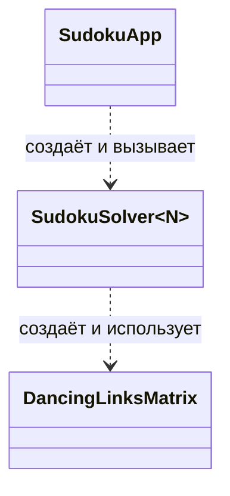

# Обзор проекта Otus_sudoku

## 1. Назначение

`Otus_sudoku` — C++23-проект для решения судоку через сведение головоломки к задаче точного покрытия и применение алгоритма Dancing Links (DLX). Библиотечный решатель поддерживает размеры `N × N`, где `N` — полный квадрат; консольное приложение работает с досками 4×4, 9×9 и 16×16.

## 2. Логика решения

Каждый вариант `(строка, столбец, цифра)` становится строкой разреженной матрицы точного покрытия и закрывает четыре ограничения:

1. в клетке находится ровно одна цифра;
2. цифра встречается в строке ровно один раз;
3. цифра встречается в столбце ровно один раз;
4. цифра встречается в блоке ровно один раз.

Для доски `N × N` создаётся `N³` вариантов и `4N²` ограничений. `SudokuSolver<N>` применяет заданные клетки, запускает поиск Algorithm X через `DancingLinksMatrix` и преобразует найденные идентификаторы строк обратно в доску. DLX выбирает столбец с минимальным числом вариантов, временно исключает конфликтующие строки операцией `cover` и восстанавливает их через `uncover` при откате.

## 3. Entrypoints

| Точка входа | CMake-цель | Назначение |
|---|---|---|
| `src/main.cpp` | `Sudoku` | Вывод справочной информации; головоломки не решает. |
| `app/app.cpp` | `SudokuApp` | Интерактивный выбор размера, ввод или загрузка доски, решение и сохранение результата. |
| `SudokuSolver<N>::solve()` | — | Основная программная точка входа решателя. |
| `tests/dancing_links/test_dancing_links.cpp` | `test_dancing_links` | Тесты структуры DLX и поиска точного покрытия. |
| `tests/sudoku/test_sudoku.cpp` | `test_sudoku` | Тесты решателя для разных размеров и ошибочных сценариев. |

## 4. Основные модули

| Модуль | Ответственность |
|---|---|
| `include/dancing_links/`, `src/dancing_links/` | Универсальная разреженная матрица DLX, операции `cover`/`uncover`, Algorithm X и управление узлами. |
| `include/sudoku/` | Header-only `SudokuSolver<N>`: преобразование судоку в exact cover, применение начальных условий и сборка результата. |
| `app/` | Консольные меню, чтение и запись досок, отображение результата и ошибок. |
| `tests/` | Легковесные модульные тесты и общие проверки из `test_utils.h`. |
| `docs/` | Техническое задание, отчёт, примеры входных данных и сгенерированная отдельно API-документация. |

Направление зависимостей: `app → sudoku → dancing_links`. DLX не зависит от правил судоку и консольного интерфейса.

## 5. Схема наследования и связей

Наследование в проекте не используется: `DancingLinksMatrix` и `SudokuSolver<N>` объявлены как `final`. Между основными компонентами есть только зависимости использования:



## 6. Сборка и запуск

Требуются CMake 3.15+, Ninja и компилятор с поддержкой C++23. Windows-пресеты используют MSVC (`cl.exe`).

```powershell
cmake --preset x64-debug
cmake --build out/build/x64-debug
ctest --test-dir out/build/x64-debug --output-on-failure
```

Запуск интерактивного приложения в Windows:

```powershell
.\out\build\x64-debug\app\SudokuApp.exe
```

Цели приложения и тестов включены по умолчанию; их можно отключить параметрами CMake `BUILD_APP=OFF` и `BUILD_TESTS=OFF`. Также доступны пресеты `x64-release`, `x86-debug`, `x86-release`, `linux-debug` и `macos-debug`.

## 7. Важные детали

- Пустая клетка обозначается `0`; текстовый формат содержит `N` строк по `N` целых чисел, разделённых пробелами.
- `SudokuSolver<N>::solve()` возвращает `std::expected<Board, SolverError>`: `INVALID_CONSTRAINTS` для конфликтующих условий и `NO_SOLUTION`, если решения нет.
- `DancingLinksMatrix::search()` возвращает `std::optional<std::vector<int>>`; отсутствие значения означает, что точного покрытия не существует.
- `DancingLinksMatrix` владеет циклически связанными узлами, запрещает копирование и поддерживает перемещение.
- Примеры входных файлов находятся в `docs/examples/`; публичный API описывается Doxygen-комментариями в `include/`.
